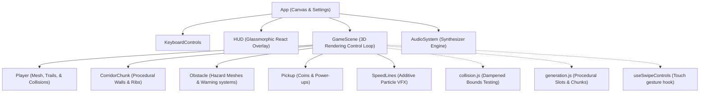

# 🌌 Neon Corridor Runner

A high-performance, visually striking 3D endless runner game set in a cyberpunk neon world. Built with **React**, **Three.js** (via **React Three Fiber**), and a procedural **Web Audio API** synthesizer. 

---

## 🎮 Play & Controls

Experience high-speed adrenaline maneuvers across three lanes while dodging hazardous obstacles and catching powerful energy nodes.

| Action | Keyboard Controls | Swipe Gestures |
| :--- | :--- | :--- |
| **Move Left** | <kbd>A</kbd> / <kbd>← (Left Arrow)</kbd> | Swipe Left |
| **Move Right** | <kbd>D</kbd> / <kbd>→ (Right Arrow)</kbd> | Swipe Right |
| **Jump** | <kbd>W</kbd> / <kbd>Space</kbd> / <kbd>↑ (Up Arrow)</kbd> | Swipe Up |
| **Slide** | <kbd>S</kbd> / <kbd>↓ (Down Arrow)</kbd> | Swipe Down |
| **Pause/Resume** | HUD Button | — |
| **Toggle Audio** | HUD Button | — |

---

## ✨ Features

- **Procedural 3D Corridor Generation**: Infinite levels dynamically constructed using modular chunking and theme rotations.
- **Synth Audio Engine**: 100% procedural synthesizer generating cyberpunk background arpeggios, dynamic beat intensities, and custom sound effects using native Web Audio API oscillators and filters. No static audio assets needed!
- **Fluid Movement & Effects**: Smooth lane-changing damping, jump/slide mechanics, speed-dependent Field of View (FOV) warping, camera-shake on impacts, and dynamic speed line VFX.
- **Progressive Difficulty Scaling**: Higher speeds and denser, more complex obstacle combinations (moving hazards, laser gates) spawn as the distance increases.
- **Cyberpunk UI Overlay**: Glassmorphism HUD showing scores, combo streaks, live multiplier adjustments, and power-up cooldown meters.
- **Performance Monitor Integration**: Real-time rendering quality adjustments (Level of Detail/DPR scaling) based on target framerates.

---

## 🧬 Project Architecture

The game utilizes a standard unidirectional data loop centered around React Three Fiber (`@react-three/fiber`), syncing React-based overlay UI with a high-performance 3D canvas thread.



### Subsystems Breakdown

#### 🪐 1. Render Layer (`src/components/`)
* **`GameScene.jsx`**: Coordinates the gameplay logic, player coordinates, camera movements, frame updates, dynamic speed increments, and score multipliers.
* **`Player.jsx`**: Renders the player model (capsule composition, glowing visor, and neon thruster cone trail). Controls scale morphing (squashing) during slides.
* **`CorridorChunk.jsx`**: Builds the modular segment boxes. Includes wall structures and arches/ribs pulsing visually to game time.
* **`Obstacle.jsx`**: Renders 4 obstacle variants:
  * `lowBarrier` (Red glowing beam: must jump)
  * `highBarrier` (Tall magenta block: must slide)
  * `movingHazard` (Spinning orange icosahedron moving horizontally: must dodge)
  * `laserGate` (Rotating laser frame ring: must slide or jump)
* **`Pickup.jsx`**: Displays rotating coin toruses and power-up octahedrons.
* **`SpeedLines.jsx`**: Speeds up lines moving against the player camera to create a convincing warping/velocity sensation.

#### 🔊 2. Synthesis Audio Engine (`src/systems/AudioSystem.js`)
Rather than downloading heavy audio files, the codebase features a complete synthesizer.
* **Background Loop**: Arpeggiator playing periodic sequence steps (`[55Hz, 82.4Hz, 110Hz, ...]`).
* **Dynamic Intensity**: Accelerating speed dynamically scales synth low-pass filters, adds hi-hat noise beats, and boosts volume thresholds.
* **Sound Effects (SFX)**: Custom frequency curves map behaviors like jumping (upwards pitch sweeps), sliding (highpass noise burst), and collecting items (chords with combo modifiers).

#### 🎲 3. Game Logic (`src/game/`)
* **`generation.js`**: Populates corridor slots based on current distance-difficulty values.
* **`collision.js`**: Calculates 3D lane depth intersections to test hits against the player's sliding/jumping/XYZ boundaries.
* **`constants.js`**: Houses physics properties (gravity, speed limits, power-up cooldowns).

---

## 🛠️ Installation & Setup

Ensure you have [Node.js](https://nodejs.org/) installed.

### 1. Install Dependencies
```bash
npm install
```

### 2. Run Locally in Development Mode
```bash
npm run dev
```
Open your browser to `http://localhost:5173` (or the host provided in your terminal).

### 3. Build for Production
To bundle the assets and compile code for production deployment:
```bash
npm run build
```

### 4. Preview Production Build
```bash
npm run preview
```

### ⚡ 5. Deploying to Vercel
This project is configured for deployment to Vercel.

#### Option A: Vercel Dashboard (Recommended)
1. Push your repository to GitHub, GitLab, or Bitbucket.
2. Visit the [Vercel Dashboard]([https://vercel.com/new](https://myendless-runner.vercel.app)) and import your repository.
3. Vercel automatically imports configuration presets from the project's root `vercel.json`.
4. Click **Deploy**.

#### Option B: Vercel CLI
Run the following commands in the project directory:
```bash
npm install -g vercel
vercel
```

---

## 🎨 Theme & Colors (Design System)

The visual theme is defined in `src/components/Materials.jsx` and `src/styles.css` using custom emissive intensities and neon color tokens:
* **Cyan Glow (`#13f7ff`)**: Represents speed, trails, and normal corridors.
* **Magenta Glow (`#ff42e8`)**: Used for obstacles and corridor accents.
* **Amber Glow (`#ffd166`)**: Represents coins, active multiplier chips, and score indicators.
* **Red Glow (`#ff355d`)**: Danger markers, barriers, and speed-burst limits.
